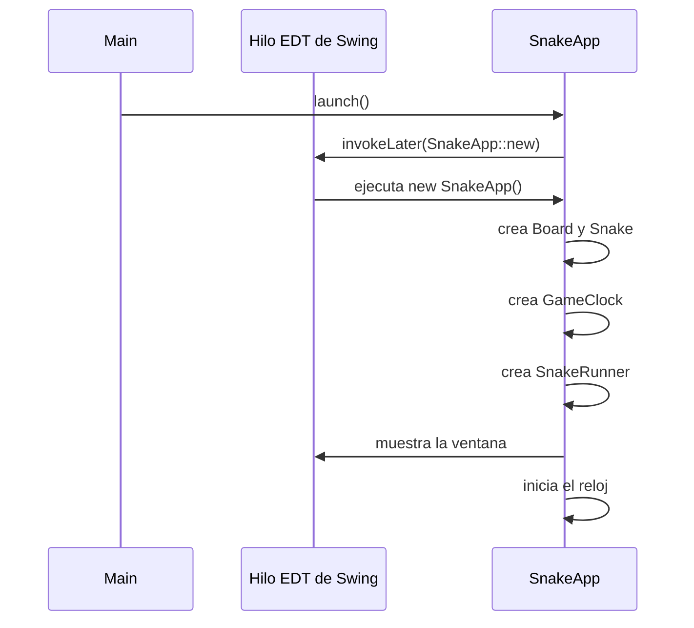
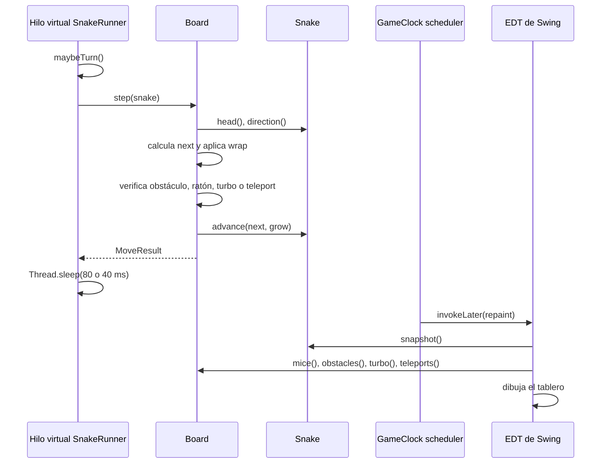

# Guía de funcionamiento de Snake Race

## 1. Descripción general

`Snake Race` es un juego de serpientes desarrollado en Java 21. El proyecto combina:

- **Swing** para la interfaz gráfica.
- **Hilos virtuales** para mover las serpientes de forma independiente.
- **`Board`** como estado compartido del tablero.
- **`GameClock`** como reloj periódico para solicitar repintados.
- **`synchronized`**, `volatile` y colecciones copiadas para coordinar el acceso concurrente.

La idea principal es que cada serpiente tiene su propio ciclo de movimiento, mientras que Swing mantiene un hilo especial para la interfaz.

---

## 2. Estructura del proyecto

```text
src/main/java/co/eci/snake/
├── app/
│   └── Main.java                 Punto de entrada
├── concurrency/
│   └── SnakeRunner.java          Movimiento de una serpiente
├── core/
│   ├── Board.java                Estado y reglas del tablero
│   ├── Direction.java            Direcciones posibles
│   ├── GameState.java            Estados del reloj
│   ├── Position.java             Coordenadas y wrap-around
│   ├── Snake.java                Estado de una serpiente
│   └── engine/
│       └── GameClock.java        Reloj periódico
└── ui/legacy/
    └── SnakeApp.java             Ventana, controles y dibujo
```

La separación puede entenderse así:

| Paquete | Responsabilidad |
|---|---|
| `app` | Iniciar la aplicación |
| `ui` | Ventana, teclado, botón y dibujo |
| `core` | Reglas y objetos del juego |
| `core.engine` | Control del reloj |
| `concurrency` | Ejecución concurrente de las serpientes |

---

## 3. Flujo de inicio

El programa comienza en [`Main.java`](src/main/java/co/eci/snake/app/Main.java):

```java
public static void main(String[] args) {
  SnakeApp.launch();
}
```

Después, [`SnakeApp.launch()`](src/main/java/co/eci/snake/ui/legacy/SnakeApp.java) realiza lo siguiente:

```java
public static void launch() {
  SwingUtilities.invokeLater(SnakeApp::new);
}
```

### ¿Qué significa `invokeLater`?

`invokeLater` coloca una tarea en la cola de eventos de Swing. La tarea se ejecutará posteriormente en el **Event Dispatch Thread**, normalmente llamado **EDT**.

En este caso, la tarea es:

```java
SnakeApp::new
```

Es una referencia al constructor `new SnakeApp()`.

La misma instrucción escrita de forma más explícita sería:

```java
SwingUtilities.invokeLater(() -> {
  new SnakeApp();
});
```

La razón de utilizarlo es que los componentes Swing deben crearse y manipularse desde el EDT. Swing no está diseñado para que varios hilos modifiquen directamente sus componentes al mismo tiempo.

### Flujo inicial



---

## 4. Creación del tablero

El constructor de `SnakeApp` crea el tablero:

```java
this.board = new Board(35, 28);
```

Esto significa:

- Ancho: `35` celdas.
- Alto: `28` celdas.
- Cada celda visual mide `20` píxeles.

El tablero genera inicialmente:

- 6 ratones.
- 4 obstáculos.
- 3 elementos turbo.
- 2 pares de teletransportadores.

Las colecciones que almacenan estos elementos están en [`Board.java`](src/main/java/co/eci/snake/core/Board.java):

```java
private final Set<Position> mice = new HashSet<>();
private final Set<Position> obstacles = new HashSet<>();
private final Set<Position> turbo = new HashSet<>();
private final Map<Position, Position> teleports = new HashMap<>();
```

`Position` es un `record`, por lo que representa una coordenada inmutable:

```java
public record Position(int x, int y) {}
```

---

## 5. Creación de las serpientes

La cantidad de serpientes se obtiene de una propiedad del sistema:

```java
int N = Integer.getInteger("snakes", 2);
```

Si no se proporciona `-Dsnakes`, se crean 2 serpientes.

Ejemplo para ejecutar con 4:

```bash
mvn -q -DskipTests exec:java -Dsnakes=4
```

Cada serpiente se construye con una posición y una dirección:

```java
snakes.add(Snake.of(x, y, dir));
```

La dirección pertenece al enum [`Direction.java`](src/main/java/co/eci/snake/core/Direction.java):

```java
public enum Direction {
  UP(0, -1),
  DOWN(0, 1),
  LEFT(-1, 0),
  RIGHT(1, 0)
}
```

Los valores `dx` y `dy` indican cuánto cambia la posición:

| Dirección | Cambio |
|---|---|
| `UP` | `(0, -1)` |
| `DOWN` | `(0, 1)` |
| `LEFT` | `(-1, 0)` |
| `RIGHT` | `(1, 0)` |

Ejemplo: si la cabeza está en `(5, 8)` y la dirección es `RIGHT`, la siguiente posición es `(6, 8)`.

---

## 6. Los hilos de las serpientes

La aplicación crea un executor de hilos virtuales:

```java
var exec = Executors.newVirtualThreadPerTaskExecutor();
```

Después envía una tarea por cada serpiente:

```java
snakes.forEach(s -> exec.submit(new SnakeRunner(s, board)));
```

Esto produce conceptualmente:

```text
Serpiente 0 -> SnakeRunner -> Hilo virtual 0
Serpiente 1 -> SnakeRunner -> Hilo virtual 1
Serpiente 2 -> SnakeRunner -> Hilo virtual 2
...
```

Un hilo virtual es un hilo ligero administrado por la JVM. Es apropiado aquí porque cada `SnakeRunner` pasa buena parte de su tiempo dormido con `Thread.sleep`.

### Ciclo de `SnakeRunner`

En [`SnakeRunner.java`](src/main/java/co/eci/snake/concurrency/SnakeRunner.java), el ciclo principal es:

```java
while (!Thread.currentThread().isInterrupted()) {
  maybeTurn();
  var res = board.step(snake);

  if (res == Board.MoveResult.HIT_OBSTACLE) {
    randomTurn();
  } else if (res == Board.MoveResult.ATE_TURBO) {
    turboTicks = 100;
  }

  int sleep = (turboTicks > 0) ? turboSleepMs : baseSleepMs;
  if (turboTicks > 0) turboTicks--;
  Thread.sleep(sleep);
}
```

Cada vuelta hace esto:

1. Puede cambiar la dirección aleatoriamente.
2. Solicita un movimiento al tablero.
3. Reacciona ante un obstáculo o un turbo.
4. Calcula el tiempo de espera.
5. Duerme.
6. Vuelve a comenzar.

Velocidades actuales:

```text
Velocidad normal: 80 ms entre movimientos
Velocidad turbo:  40 ms entre movimientos
Duración turbo:   100 movimientos
```

### Terminación por interrupción

Si el hilo es interrumpido durante `Thread.sleep`, se lanza `InterruptedException`. El código la captura y vuelve a marcar el hilo como interrumpido:

```java
} catch (InterruptedException ie) {
  Thread.currentThread().interrupt();
}
```

Esto es una buena práctica porque no se pierde la señal de interrupción.

---

## 7. Cómo se mueve una serpiente

El movimiento real se delega al tablero:

```java
var res = board.step(snake);
```

[`Board.step`](src/main/java/co/eci/snake/core/Board.java) realiza las reglas del movimiento.

### 7.1 Calcular la siguiente posición

```java
Position next = new Position(
    head.x() + dir.dx,
    head.y() + dir.dy
).wrap(width, height);
```

El método `wrap` hace que el tablero se comporte como si sus bordes estuvieran conectados.

Ejemplo con ancho `35`:

```text
x = 34, movimiento RIGHT -> x = 0
x = 0,  movimiento LEFT  -> x = 34
```

### 7.2 Obstáculos

Si la siguiente posición contiene un obstáculo:

```java
if (obstacles.contains(next)) {
  return MoveResult.HIT_OBSTACLE;
}
```

La serpiente no avanza. Luego `SnakeRunner` selecciona una dirección aleatoria.

### 7.3 Teletransportadores

Si la posición pertenece al mapa de teletransportadores:

```java
if (teleports.containsKey(next)) {
  next = teleports.get(next);
  teleported = true;
}
```

La serpiente aparece en la posición asociada.

### 7.4 Ratones

Si la serpiente llega a un ratón:

```java
boolean ateMouse = mice.remove(next);
snake.advance(next, ateMouse);
```

El parámetro `ateMouse` indica que la serpiente debe crecer.

Después se crea otro ratón y otro obstáculo:

```java
if (ateMouse) {
  mice.add(randomEmpty());
  obstacles.add(randomEmpty());
}
```

### 7.5 Turbo

Si pisa un turbo:

```java
boolean ateTurbo = turbo.remove(next);
```

El resultado llega a `SnakeRunner`, que activa:

```java
turboTicks = 100;
```

Durante esos ciclos el `sleep` baja de `80 ms` a `40 ms`.

---

## 8. Protección del tablero con `synchronized`

El tablero es compartido por todos los `SnakeRunner` y por el EDT de Swing. Por ejemplo, varios hilos pueden intentar comer un ratón casi al mismo tiempo.

Por esa razón, `step` está declarado así:

```java
public synchronized MoveResult step(Snake snake)
```

`synchronized` funciona como un candado asociado al objeto `board`.

Mientras un hilo está ejecutando `step`:

- Otro hilo no puede entrar simultáneamente a otro método `synchronized` del mismo `Board`.
- Las operaciones de comprobar y modificar ratones, obstáculos y turbo forman una operación protegida.

Ejemplo del riesgo sin sincronización:

```text
Hilo A: comprueba que hay un ratón
Hilo B: comprueba que hay un ratón
Hilo A: lo elimina y lo come
Hilo B: también intenta procesar el mismo estado
```

Con `synchronized`, los movimientos se procesan uno a la vez.

Los métodos de lectura también son sincronizados y devuelven copias:

```java
public synchronized Set<Position> mice() {
  return new HashSet<>(mice);
}
```

La interfaz recibe una fotografía independiente del conjunto interno.

---

## 9. Estado de una serpiente y `volatile`

En [`Snake.java`](src/main/java/co/eci/snake/core/Snake.java), la dirección se declara como:

```java
private volatile Direction direction;
```

Esto es necesario porque:

- El EDT cambia la dirección cuando el usuario presiona una tecla.
- El hilo virtual de la serpiente lee la dirección dentro de `Board.step`.

`volatile` garantiza que el hilo de movimiento vea el valor actualizado.

Sin `volatile`, el hilo podría conservar temporalmente un valor antiguo en caché.

### El cuerpo de la serpiente

El cuerpo usa:

```java
private final Deque<Position> body = new ArrayDeque<>();
```

La interfaz no recibe el deque directamente. Usa:

```java
public Deque<Position> snapshot() {
  return new ArrayDeque<>(body);
}
```

La intención es entregar una copia. Sin embargo, la copia se realiza mientras otro hilo puede estar modificando `body` en `advance`. Por ello, esta parte todavía puede tener una condición de carrera bajo carga.

Una protección más completa sería sincronizar ambos métodos sobre el mismo objeto:

```java
public synchronized Deque<Position> snapshot() {
  return new ArrayDeque<>(body);
}

public synchronized void advance(Position newHead, boolean grow) {
  body.addFirst(newHead);
  if (grow) maxLength++;
  while (body.size() > maxLength) body.removeLast();
}
```

Si se adopta esta solución, todos los accesos que lean o modifiquen `body` deben respetar la misma protección.

---

## 10. El reloj y el repintado

[`GameClock.java`](src/main/java/co/eci/snake/core/engine/GameClock.java) utiliza un scheduler de un solo hilo:

```java
private final ScheduledExecutorService scheduler =
    Executors.newSingleThreadScheduledExecutor();
```

En `start()` programa una tarea repetitiva:

```java
scheduler.scheduleAtFixedRate(
    () -> {
      if (state.get() == GameState.RUNNING) tick.run();
    },
    0,
    periodMillis,
    TimeUnit.MILLISECONDS
);
```

El periodo usado por `SnakeApp` es `60 ms`.

El `tick` fue creado así:

```java
this.clock = new GameClock(
    60,
    () -> SwingUtilities.invokeLater(gamePanel::repaint)
);
```

Aquí ocurren dos pasos distintos:

1. El scheduler ejecuta el callback.
2. `invokeLater` pone `repaint` en la cola del EDT.

Esto es importante: el scheduler no dibuja directamente. Solo solicita que Swing repinte desde su hilo correcto.

---

## 11. Cómo se dibuja la pantalla

Swing llama a `GamePanel.paintComponent(Graphics g)` en el EDT.

El método dibuja en este orden:

1. Fondo y cuadrícula.
2. Obstáculos.
3. Ratones.
4. Teletransportadores.
5. Elementos turbo.
6. Serpientes.

Para las serpientes obtiene una copia del cuerpo:

```java
var body = s.snapshot().toArray(new Position[0]);
```

Luego convierte cada posición del tablero en píxeles:

```java
p.x() * cell
p.y() * cell
```

Como `cell` vale `20`, la posición `(3, 4)` se pinta aproximadamente en:

```text
pixel X = 3 * 20 = 60
pixel Y = 4 * 20 = 80
```

---

## 12. Flujo completo de un movimiento



Los movimientos y repintados son independientes. Un repintado puede ocurrir entre dos movimientos o mientras diferentes serpientes están avanzando.

---

## 13. Pausa y reanudación actuales

El botón ejecuta:

```java
private void togglePause() {
  if ("Action".equals(actionButton.getText())) {
    actionButton.setText("Resume");
    clock.pause();
  } else {
    actionButton.setText("Action");
    clock.resume();
  }
}
```

`clock.pause()` solo cambia el estado del `GameClock` a `PAUSED`.

Por eso, en la implementación actual:

```text
La pantalla deja de actualizarse visualmente.
Las serpientes continúan moviéndose en sus hilos virtuales.
Al reanudar, la pantalla muestra el estado más reciente.
```

Esto no es una pausa completa del juego. Para pausar la simulación también sería necesario que los `SnakeRunner` consultaran un estado compartido o utilizaran una coordinación adicional, por ejemplo `Lock` y `Condition`.

Una solución conceptual sería:

```java
while (!Thread.currentThread().isInterrupted()) {
  pauseController.awaitIfPaused();
  board.step(snake);
  Thread.sleep(sleep);
}
```

La condición debería bloquear el hilo sin consumir CPU y despertarlo al reanudar.

---

## 14. Resumen de los hilos

| Hilo | Quién lo crea | Qué hace |
|---|---|---|
| Hilo principal | JVM | Ejecuta `Main.main` |
| EDT | Swing | Construye y atiende la interfaz |
| Scheduler | `GameClock` | Genera ticks periódicos |
| Hilo virtual por serpiente | `Executor` | Ejecuta `SnakeRunner` |

### Regla práctica

- Los `SnakeRunner` cambian el estado del juego.
- El `GameClock` solicita repintados.
- El EDT pinta y procesa controles.
- `Board` protege el estado común del tablero.
- `Snake` mantiene el estado individual de cada serpiente.

---

## 15. Posibles problemas de concurrencia

### 15.1 El cuerpo de `Snake` puede leerse mientras se modifica

`advance` modifica `body` y `snapshot` lo copia. Como `ArrayDeque` no es thread-safe, ambos métodos deberían sincronizarse sobre el mismo objeto.

### 15.2 Pausar el reloj no pausa los movimientos

El estado `PAUSED` solo es consultado por `GameClock`, no por `SnakeRunner`.

### 15.3 El executor no se guarda ni se cierra explícitamente

La variable `exec` es local al constructor:

```java
var exec = Executors.newVirtualThreadPerTaskExecutor();
```

Para un cierre controlado, convendría conservarlo como atributo y cerrarlo cuando se cierre la ventana.

### 15.4 La lista de serpientes no cambia después de iniciar

La lista se construye al inicio y luego se lee desde la interfaz. Como no se agregan ni eliminan serpientes durante la partida, el riesgo es menor. Aun así, si en el futuro se modificara dinámicamente, habría que protegerla o usar una colección concurrente.

---

## 16. Cómo ejecutar el proyecto

Requisitos:

- JDK 21.
- Maven 3.9 o superior.

Compilar y ejecutar pruebas:

```bash
mvn clean verify
```

Ejecutar con la cantidad predeterminada de serpientes:

```bash
mvn -q -DskipTests exec:java
```

Ejecutar con 10 serpientes:

```bash
mvn -q -DskipTests exec:java -Dsnakes=10
```

Controles:

| Tecla | Acción |
|---|---|
| Flechas | Controlan la serpiente 0 |
| `W`, `A`, `S`, `D` | Controlan la serpiente 1 |
| Espacio | Pausar o reanudar el reloj visual |
| Botón `Action` | Pausar o reanudar el reloj visual |

---

## 17. Resumen final

El flujo esencial del proyecto es:

```text
Main
  -> SnakeApp.launch()
  -> invokeLater(...)
  -> creación de la ventana en el EDT
  -> creación de Board y Snake
  -> un SnakeRunner por serpiente
  -> cada SnakeRunner llama Board.step()
  -> GameClock solicita repaint()
  -> EDT ejecuta paintComponent()
```

La concurrencia existe porque varios hilos pueden mover serpientes simultáneamente y todos comparten el mismo `Board`. `Board.step` usa `synchronized` para proteger sus colecciones. La dirección de cada serpiente usa `volatile` para comunicar los cambios del teclado al hilo de movimiento.

El punto más importante para el análisis del laboratorio es diferenciar entre **simulación** y **visualización**: actualmente el reloj controla el repintado, pero los hilos de las serpientes siguen ejecutándose durante la pausa.
