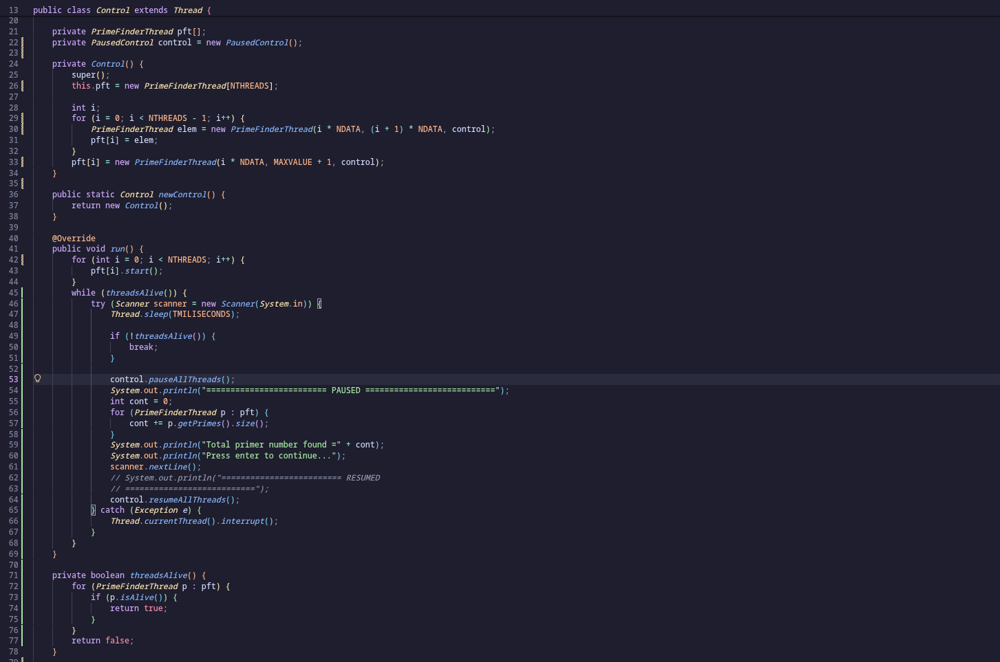
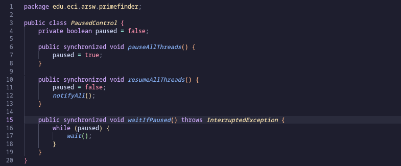
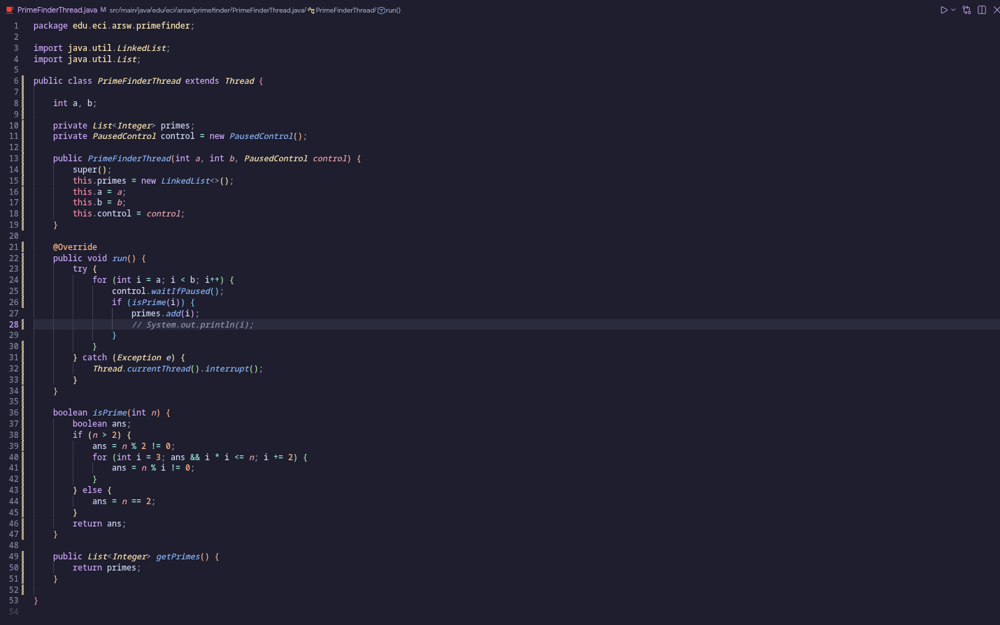
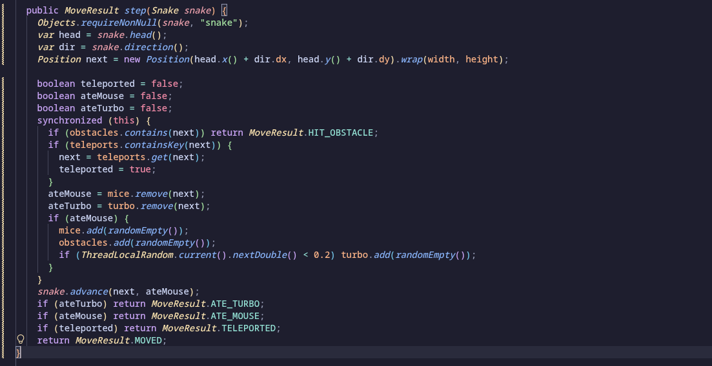
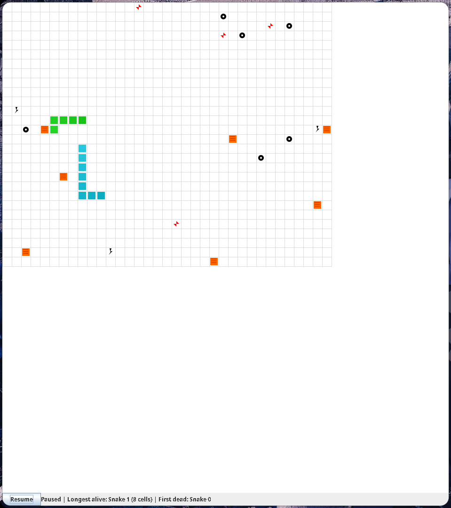

# Snake Race — ARSW Lab #2 (Java 21, Virtual Threads)

**Escuela Colombiana de Ingeniería – Arquitecturas de Software**  
Laboratorio de programación concurrente: condiciones de carrera, sincronización y colecciones seguras.

---

## Estudiantes

 - Roger Mauricio Duran Guacaneme
 - Camilo Alfonso Leon Acosta

---

## Requisitos

- **JDK 21** (Temurin recomendado)
- **Maven 3.9+**
- SO: Windows, macOS o Linux

---

## Cómo ejecutar

```bash
mvn clean verify
mvn -q -DskipTests exec:java -Dsnakes=4
```

- `-Dsnakes=N` → inicia el juego con **N** serpientes (por defecto 2).
- **Controles**:
  - **Flechas**: serpiente **0** (Jugador 1).
  - **WASD**: serpiente **1** (si existe).
  - **Espacio** o botón **Start / Pause / Resume**: controlar la ejecución.

---

## Reglas del juego (resumen)

- **N serpientes** corren de forma autónoma (cada una en su propio hilo).
- **Ratones**: al comer uno, la serpiente **crece** y aparece un **nuevo obstáculo**.
- **Obstáculos**: si la cabeza entra en un obstáculo hay **rebote**.
- **Teletransportadores** (flechas rojas): entrar por uno te **saca por su par**.
- **Rayos (Turbo)**: al pisarlos, la serpiente obtiene **velocidad aumentada** temporal.
- Movimiento con **wrap-around** (el tablero “se repite” en los bordes).

---

## Arquitectura (carpetas)

```
co.eci.snake
├─ app/                 # Bootstrap de la aplicación (Main)
├─ core/                # Dominio: Board, Snake, Direction, Position
├─ core/engine/         # GameClock (ticks, Pausa/Reanudar)
├─ concurrency/         # SnakeRunner (lógica por serpiente con virtual threads)
└─ ui/legacy/           # UI estilo legado (Swing) con grilla y botón Action
```

---

# Actividades del laboratorio

## Parte I — (Calentamiento) `wait/notify` en un programa multi-hilo

1. Toma el programa [**PrimeFinder**](https://github.com/ARSW-ECI/wait-notify-excercise).
2. Modifícalo para que **cada _t_ milisegundos**:
   - Se **pausen** todos los hilos trabajadores.
   - Se **muestre** cuántos números primos se han encontrado.
   - El programa **espere ENTER** para **reanudar**.
3. La sincronización debe usar **`synchronized`**, **`wait()`**, **`notify()` / `notifyAll()`** sobre el **mismo monitor** (sin _busy-waiting_).
4. Entrega en el reporte de laboratorio **las observaciones y/o comentarios** explicando tu diseño de sincronización (qué lock, qué condición, cómo evitas _lost wakeups_).

> Objetivo didáctico: practicar suspensión/continuación **sin** espera activa y consolidar el modelo de monitores en Java.


## Solucion primer parte

2. Las modificaciones las cuales se le hicieron a los codigos fueron las siguientes:
    
    
    
     

    Bajo este concepto podemos ver la creacion de una clase llamada PausedControl, la cual nos va a permitir el uso de las pausas y reactivacion de los ciclos cuando usemos estos mismo para pararlos.
    
3. La clase `PausedControl` utiliza el mismo monitor compartido por todos los hilos `PrimeFinderThread`. Sus métodos `pauseAllThreads()`, `resumeAllThreads()` y `waitIfPaused()` son `synchronized`, por lo que solo un hilo puede modificar o consultar la condición de pausa a la vez. La variable `paused` representa la condición: cuando es `true`, cada trabajador ejecuta `wait()` y queda suspendido sin consumir CPU. Cuando el usuario presiona ENTER, `resumeAllThreads()` cambia `paused` a `false` y ejecuta `notifyAll()`, despertando a todos los trabajadores para que continúen.

4. El uso de `while (paused)` evita problemas de notificaciones perdidas y despertares inesperados: después de despertar, cada hilo vuelve a comprobar la condición antes de continuar. Se utiliza `notifyAll()` porque pueden existir varios `PrimeFinderThread` esperando sobre el mismo monitor; `notify()` solo despertaría a uno. No hay busy-waiting, porque los hilos no revisan continuamente la condición: permanecen bloqueados con `wait()` y se reactivan mediante `notifyAll()`. La pausa no es instantánea, ya que cada trabajador se detiene cuando llega a `waitIfPaused()`.

---

## Parte II — SnakeRace concurrente (núcleo del laboratorio)

### 1) Análisis de concurrencia

- Explica **cómo** el código usa hilos para dar autonomía a cada serpiente.
- **Identifica** y documenta en **`el reporte de laboratorio`**:
  - Posibles **condiciones de carrera**.
  - **Colecciones** o estructuras **no seguras** en contexto concurrente.
  - Ocurrencias de **espera activa** (busy-wait) o de sincronización innecesaria.

### 2) Correcciones mínimas y regiones críticas

- **Elimina** esperas activas reemplazándolas por **señales** / **estados** o mecanismos de la librería de concurrencia.
- Protege **solo** las **regiones críticas estrictamente necesarias** (evita bloqueos amplios).
- Justifica en **`el reporte de laboratorio`** cada cambio: cuál era el riesgo y cómo lo resuelves.

### 3) Control de ejecución seguro (UI)

- Implementa la **UI** con **Iniciar / Pausar / Reanudar** (ya existe el botón _Action_ y el reloj `GameClock`).
- Al **Pausar**, muestra de forma **consistente** (sin _tearing_):
  - La **serpiente viva más larga**.
  - La **peor serpiente** (la que **primero murió**).
- Considera que la suspensión **no es instantánea**; coordina para que el estado mostrado no quede “a medias”.

### 4) Robustez bajo carga

- Ejecuta con **N alto** (`-Dsnakes=20` o más) y/o aumenta la velocidad.
- El juego **no debe romperse**: sin `ConcurrentModificationException`, sin lecturas inconsistentes, sin _deadlocks_.
- Si habilitas **teleports** y **turbo**, verifica que las reglas no introduzcan carreras.System.out.println("========================= RESUMED ===========================");

> Entregables detallados más abajo.

## Solucion segunda parte

1. Cada serpiente se ejecuta de forma independiente mediante un `SnakeRunner` enviado a un hilo virtual. En cada ciclo, el hilo cambia opcionalmente la dirección, ejecuta `board.step(snake)` y espera con `Thread.sleep`, permitiendo que las demás serpientes continúen simultáneamente. El tablero es un recurso compartido, pero sus colecciones se protegen con métodos `synchronized` y las lecturas devuelven copias. La dirección de cada serpiente es `volatile` porque la modifica la UI y la lee su hilo de movimiento. Existe una posible condición de carrera sobre el cuerpo (`ArrayDeque`) entre `advance` y `snapshot`, por lo que ambos métodos deben sincronizarse. No se detecta busy-waiting: los hilos utilizan `Thread.sleep` y el reloj usa `scheduleAtFixedRate`; sin embargo, la pausa actual detiene los repintados, pero no los hilos de las serpientes.

2. En `Board.step(...)` se modificó la sincronización para proteger únicamente la región crítica que accede a las colecciones compartidas del tablero. El cálculo de la siguiente posición se realiza antes del bloqueo, mientras que la verificación de obstáculos, teletransportadores, ratones y turbo se ejecuta dentro de `synchronized (this)`. De esta manera, dos hilos no pueden modificar simultáneamente esas colecciones ni consumir el mismo recurso, pero el bloqueo no cubre operaciones que no pertenecen al estado común del tablero.

    `snake.advance(next, ateMouse)` se dejó fuera del bloque sincronizado porque modifica únicamente el estado de esa serpiente y no las colecciones del tablero. Así se reduce el tiempo durante el cual otros hilos deben esperar para acceder al tablero. En esta clase no existe espera activa: los hilos se bloquean mediante `synchronized` cuando es necesario y el movimiento espera mediante `Thread.sleep`, sin consumir CPU en un ciclo de comprobación continua.
  
    

    La región crítica tiene el alcance mínimo necesario: protege las operaciones `contains`, `remove` y `add` que deben ejecutarse coordinadamente. La modificación no resuelve la posible carrera entre `Snake.advance(...)` y `Snake.snapshot()`, porque esa protección pertenece a `Snake` y debe implementarse allí sincronizando ambos métodos sobre el mismo monitor.

  3. La UI ahora tiene tres estados: **Start**, **Pause** y **Resume**. Al iniciar se crean los `SnakeRunner` y comienza `GameClock`. Al pausar, `GameClock` activa una bandera protegida por `ReentrantLock` y `Condition`; cada runner llega a `awaitIfPaused()` y espera sin consumir CPU. La UI ejecuta `awaitPaused()` en un hilo virtual y solo después actualiza el estado visual, garantizando que ningún runner esté modificando una serpiente mientras se calculan las estadísticas.

    Durante la pausa se calcula la serpiente viva más larga usando una lectura sincronizada de `length()`. Para registrar la peor serpiente, `Snake` mantiene `alive` y un `deathOrder` asignado atómicamente cuando ocurre una colisión con su propio cuerpo. La primera serpiente que muere es la que tiene el menor `deathOrder`. Si todavía no ha muerto ninguna, la UI muestra `none`.

  4. Para soportar una carga alta, cada runner usa un hilo virtual y el estado compartido del tablero se modifica dentro de la región crítica de `Board.step(...)`. Las colecciones `HashSet` y `HashMap` no se exponen directamente: los métodos de lectura devuelven copias y están sincronizados. Además, `Snake.snapshot()`, `advance()`, `contains()`, `length()` e `isAlive()` están sincronizados para evitar lecturas inconsistentes del `ArrayDeque`.

      La coordinación usa `Condition` y no busy-waiting: los runners esperan mediante `await()` y se despiertan con `signalAll()` al reanudar. Al cerrar la ventana se detienen el `GameClock` y el executor. La prueba de carga se puede realizar con:

      ```bash
      mvn clean verify
      mvn -q -DskipTests exec:java -Dsnakes=20
      ```

      Durante la prueba se debe verificar que no aparezcan `ConcurrentModificationException`, lecturas parciales, deadlocks ni errores al consumir teletransportadores o turbo. La protección del tablero hace que la operación de retirar un ratón o turbo y generar nuevos elementos sea atómica para todos los runners.

      


---

## Entregables

1. **Código fuente** funcionando en **Java 21**.
2. Todo de manera clara en **`**el reporte de laboratorio**`** con:
   - Data races encontradas y su solución.
   - Colecciones mal usadas y cómo se protegieron (o sustituyeron).
   - Esperas activas eliminadas y mecanismo utilizado.
   - Regiones críticas definidas y justificación de su **alcance mínimo**.
3. UI con **Iniciar / Pausar / Reanudar** y estadísticas solicitadas al pausar.

---

## Criterios de evaluación (10)

- (3) **Concurrencia correcta**: sin data races; sincronización bien localizada.
- (2) **Pausa/Reanudar**: consistencia visual y de estado.
- (2) **Robustez**: corre **con N alto** y sin excepciones de concurrencia.
- (1.5) **Calidad**: estructura clara, nombres, comentarios; sin _code smells_ obvios.
- (1.5) **Documentación**: **`reporte de laboratorio`** claro, reproducible;

---

## Tips y configuración útil

- **Número de serpientes**: `-Dsnakes=N` al ejecutar.
- **Tamaño del tablero**: cambiar el constructor `new Board(width, height)`.
- **Teleports / Turbo**: editar `Board.java` (métodos de inicialización y reglas en `step(...)`).
- **Velocidad**: ajustar `GameClock` (tick) o el `sleep` del `SnakeRunner` (incluye modo turbo).

---

## Cómo correr pruebas

```bash
mvn clean verify
```

Incluye compilación y ejecución de pruebas JUnit. Si tienes análisis estático, ejecútalo en `verify` o `site` según tu `pom.xml`.

---

## Créditos

Este laboratorio es una adaptación modernizada del ejercicio **SnakeRace** de ARSW. El enunciado de actividades se conserva para mantener los objetivos pedagógicos del curso.

**Base construida por el Ing. Javier Toquica.**
